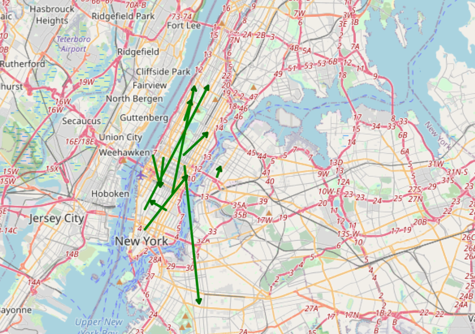
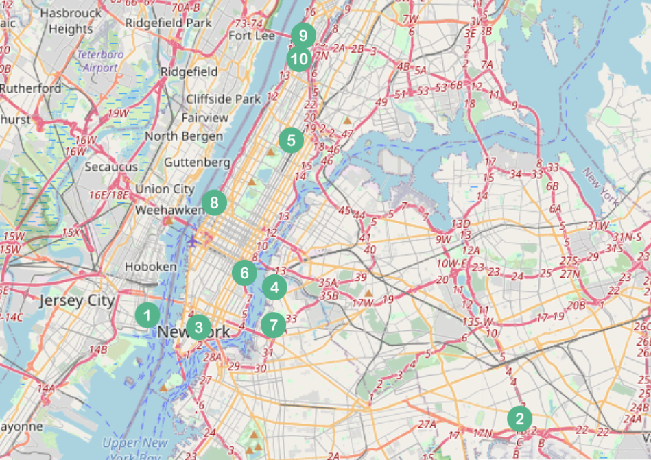

### Summary:

This project is an adaptation from [DEBS 2015 Grand Challenge](http://www.debs2015.org/call-grand-challenge.html), using Kafka to publish the data set, Spark Streaming for processing and Leaflet to show the results.

The goal of the challenge is to analyze a stream of taxi trips based on a stream of trip reports from New York City, with a special focus on discovering frequent routes and high profit regions. A sample output for both scenarios can be viewed in the images below.

Frequent Routes         |  Profitable Areas
:-------------------------:|:-------------------------:
  |  

The data set used includes the first 20 days of 2013, having roughly 2M events and 130mb of total size. It's also possible to test the application with data from the full year of 2013, available [here](https://drive.google.com/file/d/0B4zFfvIVhcMzcWV5SEQtSUdtMWc/view).

For testing and demo purposes, the publishing process was sped up such that it takes about 1 second of real time to process 1 minute of data timestamps (corresponding to pickup and drop off times). The stream window of 30 minutes is thus adjusted to 30 seconds too. As for the map itself, it is updated every 10 seconds, accounting for the sliding window of 5 seconds and the processing overhead of both queries.

### Usage:

Use docker to run the application:

```
git clone https://github.com/danielmurteira/stream-taxis.git
docker build -t dmurteira/stream-taxis -f docker/Dockerfile .
docker run --name stream-taxis -p 9090:9090 --rm -d dmurteira/stream-taxis
```

Map updates can be viewed at:

- http://localhost:9090/FreqRoutes.html
- http://localhost:9090/ProfitAreas.html